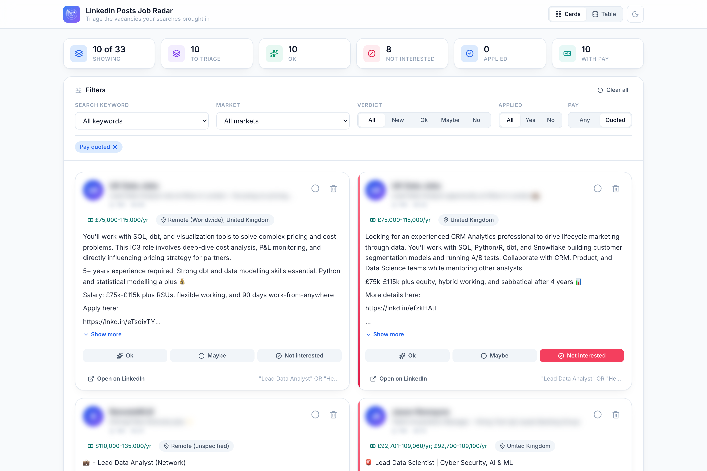
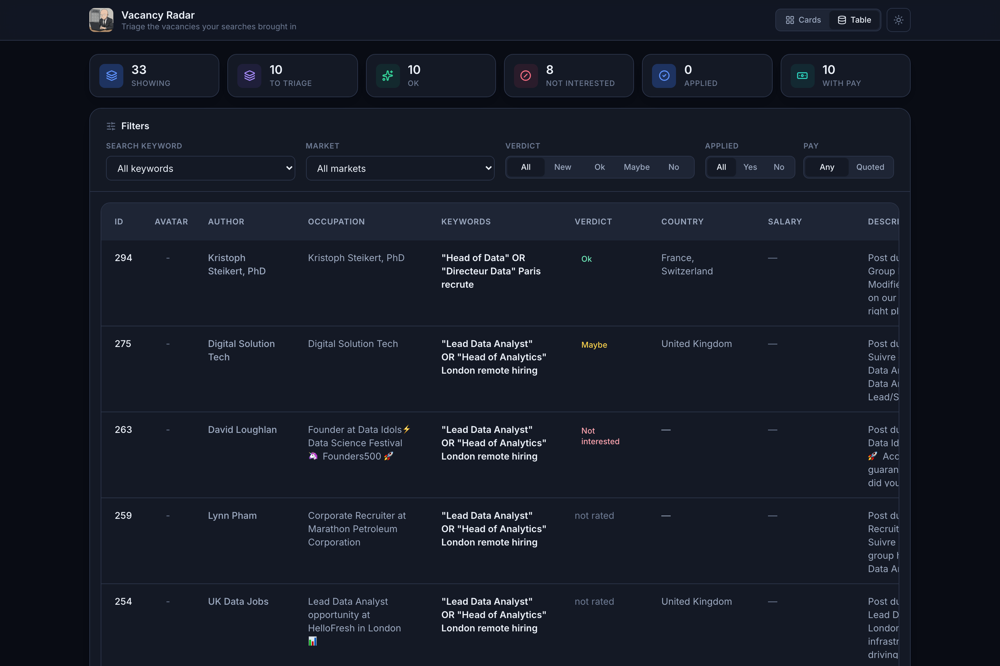
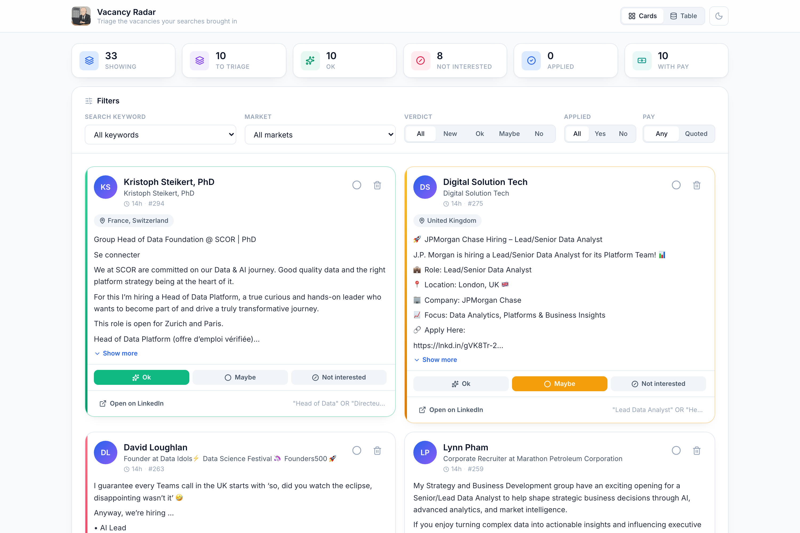

<div align="center">


# Linkedin Posts Job Radar

**Find real job openings on LinkedIn without the noise**

[](https://modelcontextprotocol.io)
[](https://www.typescriptlang.org/)
[](https://playwright.dev/)
[](https://react.dev/)
[](https://expressjs.com/)
[](https://vite.dev/)
[](https://tailwindcss.com/)
[](https://sqlite.org/)
[](LICENSE)

</div>

---

Ask your AI assistant to search LinkedIn. Linkedin Posts Job Radar scrapes the
results, throws away everything that isn't an employer hiring in a market you
care about, and gives you a dashboard to sort what's left into **Ok**,
**Maybe** and **Not interested**.

Everything stays on your machine. No accounts, no servers, no data leaving your
laptop.



---

## Why

Search LinkedIn for "Senior Data Scientist" and you get open roles mixed in with
people announcing they're available, course ads, newsletter roundups, and the
same staffing-agency repost twenty times over — most of it in countries you
can't work in.

Linkedin Posts Job Radar screens each post **before** it's saved, so you triage a short
list instead of wading through hundreds:

```
Harvest complete: 9 new posts added, 3 duplicates skipped,
12 rejected as outside allowed markets,
18 rejected as non-vacancy or agency posts
```

---

## Install

You'll need [Node.js 18+](https://nodejs.org) and an MCP client such as Claude
Code, Claude Desktop, or Cursor. Chromium downloads itself on first use.

### Quickest: no clone

Point your client straight at the repo — npm fetches and builds it for you.

<details open>
<summary><b>Claude Code</b></summary>

```bash
claude mcp add job-radar -- npx -y github:MaryemeBay/linkedin-posts-job-radar
```
</details>

<details>
<summary><b>Claude Desktop</b> — <code>claude_desktop_config.json</code></summary>

```json
{
  "mcpServers": {
    "job-radar": {
      "command": "npx",
      "args": ["-y", "github:MaryemeBay/linkedin-posts-job-radar"]
    }
  }
}
```
</details>

<details>
<summary><b>Cursor</b> — <code>mcp.json</code></summary>

```json
{
  "mcpServers": {
    "job-radar": {
      "command": "npx",
      "args": ["-y", "github:MaryemeBay/linkedin-posts-job-radar"]
    }
  }
}
```
</details>

The first start takes a couple of minutes while it builds and fetches Chromium;
later starts are immediate.

> Changing the screening rules needs the source, so clone if you want to tune
> which markets are allowed.

### Clone, to change the rules

```bash
git clone https://github.com/MaryemeBay/linkedin-posts-job-radar.git
cd linkedin-posts-job-radar
npm run setup
npm run build
```

Register it with the absolute path to where you cloned it:

```bash
claude mcp add job-radar -- node /absolute/path/to/linkedin-posts-job-radar/build/main.js
```

For Claude Desktop or Cursor use the JSON above, with `"command": "node"` and
`"args": ["/absolute/path/.../build/main.js"]`.

### As a bundle

`npm run bundle` produces a `.mcpb` file that clients supporting MCP bundles can
install directly, with no Node tooling needed on the installing machine.

### Set your markets

Open [`src/intake/market-policy.ts`](src/intake/market-policy.ts) and list the
places you'd actually take a job:

```ts
export const ALLOWED_COUNTRIES = [
  'France',
  'United Kingdom',
  'Remote (Europe)',
  'Remote (Worldwide)',
]
```

Only needed if you cloned. Run `npm run build` after editing — anything outside
this list never reaches your database.

---

## Use it

Talk to your assistant in plain language:

> **"Log into my LinkedIn account"**
> A browser window opens. Log in once — the session is saved locally, so you
> won't be asked again.

> **"Search LinkedIn for Senior Data Scientist roles in London"**
> Harvests the results and reports what it kept and what it screened out.

> **"Open the dashboard"**
> Opens `localhost:7391`. Rate posts Ok / Maybe / Not interested.

> **"Show me everything I marked Ok that quotes a salary"**
> Filters the dashboard from the conversation.

> **"Delete everything I marked Not interested"**

### The dashboard

Rate a post and its accent rail takes on that colour, so a long list stays
readable at a glance. A "Not interested" card dims until you hover it. Clicking
a rating a post already has clears it, so a mis-click needs one more click
rather than a fourth button.

`Applied` is tracked separately — the verdict is what you think of the role,
`Applied` is whether you acted on it.

Every post shows the **country** and any **pay** it quotes, both pulled out of
the post text automatically.

<details>
<summary><b>Table view</b> — edit and sort every field</summary>


</details>

<details>
<summary><b>Light theme</b> — follows your OS by default, toggle in the corner</summary>


</details>

---

## What gets thrown away

Three gates, applied as posts arrive:

| Gate | Rejects |
| --- | --- |
| **Relevance** | Posts with no sign of an open role — commentary, roundups, course ads |
| **Author** | "Open to work" posts, and staffing-agency reposts |
| **Market** | Roles outside your allowed countries |

**Relevance** looks for hiring intent broadly, because plenty of real listings
never say "hiring" — `Lead Data Analyst opportunity at HelloFresh in London` is
a job post.

**Author** catches agencies two ways: wording like `our client`, `on behalf of`,
`C2C` or `Outside IR35`, and titles like Recruitment Consultant or Executive
Recruiter. Titles that exist on both sides — plain "Recruiter", "Talent
Acquisition" — never reject on their own, and `Corporate Recruiter` is treated
as in-house. An employer's own recruiter is exactly who you want to hear from.

**Market** accepts a post that names any allowed country. Mentioning an
unwanted one isn't disqualifying — a Paris role that mentions visa rules for
applicants elsewhere is still a Paris role. Posts with no detectable location
are kept, since plenty of real listings don't state one.

> **Want contract roles?** `umbrella`, `Outside IR35` and `C2C` are treated as
> agency signals. Remove them from `AGENCY_BODY` in
> [`src/intake/relevance.ts`](src/intake/relevance.ts) to let contract work
> through.

### Location detection

Recognises around 105 countries by name and by city, in English, French, German,
Spanish and Portuguese, plus code lists like `Remote EU (CZ/EE/FI/PL/ES/SE)`.

An explicit location line wins outright. When a post says `📍 Location: London,
UK` or `Lieu : Paris`, that line decides — so a post headed
`📍 Islamabad, Pakistan` that mentions London further down is correctly an
Islamabad role, not a London one.

### Pay detection

Each currency figure is classified by pay period and kept only if the amount
makes sense for that period. That's what tells a real salary apart from a
`$2,000 welcome bonus` or `€12.50/day` meal vouchers, and what keeps
`$100/hour` while rejecting a bare `$100`.

Handles `$128,470 - $208,770`, `96k€`, `£75k-£115k`, `110000USD-135000USD`,
`60,4K GBP/yr` (French decimal comma), `£830/day` and `$7,000/month`.

---

## Your data

| What | Where |
| --- | --- |
| Harvested posts | `~/.linkedin-mcp/resources/linkedin.db` |
| LinkedIn session | `~/.linkedin-mcp/auth.json` |

Both live outside this repo and are never committed. Nothing is sent anywhere —
the dashboard is a local server, and the only network traffic is Playwright
talking to LinkedIn as your own browser would.

To wipe everything: `rm -rf ~/.linkedin-mcp`

---

## Tools your assistant can call

| Tool | What it does |
| --- | --- |
| `linkedin_session` | Log in, check the session, clear stored credentials |
| `harvest_posts` | Search and store posts, reporting what was screened out |
| `vacancies` | Read, count or delete — filter by keyword, market, pay, verdict, applied |
| `dashboard_filters` | Change the dashboard's filters from the conversation |
| `open_dashboard` / `close_dashboard` | Start and stop the dashboard |

## Commands

```bash
npm run viewer      # dashboard on :7391, without going through your assistant
npm run rederive    # recompute country and pay for stored posts
npm run seed        # import posts from a JSON export
npm run build       # rebuild after changing any rule
npm run typecheck
```

`npm run rederive -- --all` re-infers every post rather than only the blanks —
run it after editing a detector.

To move the dashboard off port 7391:

```bash
JOB_RADAR_PORT=9090 npm run viewer
```

When your MCP client launches the server, put `JOB_RADAR_PORT` in that
server's `env` block so `open_dashboard` uses the same port.

---

## Code layout

```
src/
  main.ts               MCP server: tool schemas and dispatch
  commands/             One module per tool
  linkedin/
    session/            Playwright login, credential storage
    harvest/            Search crawler, URL building, post parsing
  intake/               The screening pipeline
    ingest.ts             Applies every gate, then writes
    relevance.ts          Vacancy vs commentary vs agency
    market-policy.ts      Country allowlist  <- edit this
    location.ts           Country inference
    compensation.ts       Pay parsing
  store/                SQLite handle, schema, queries
  viewer/               Dashboard API and React app
  platform/             Paths, persisted filter state
scripts/                Maintenance scripts
```

<details>
<summary><b>A note for contributors: the database is held in memory</b></summary>

The store is `sql.js`, which keeps the whole database in memory and writes it
back wholesale. With two processes running — the MCP server and the dashboard —
each would otherwise serve a stale snapshot and overwrite the other's rows on
its next save.

`store/connection.ts` fingerprints the file by size and modification time,
reloads when another process has written, and records its own saves so it
doesn't reload needlessly. **Removing that check silently loses data.**
</details>

---

## Attribution

Derived from
[LinkedIn-Posts-Hunter-MCP-Server](https://github.com/kevin-weitgenant/LinkedIn-Posts-Hunter-MCP-Server)
by Kevin Weitgenant, used under the ISC licence.

This fork reorganises the codebase around the intake pipeline, adds the
relevance, agency and market screening above, adds country and pay inference,
replaces a saved flag with the triage verdict, renames the MCP tools, rebuilds
the dashboard, and fixes cross-process database clobbering.

Licensed ISC — see [LICENSE](LICENSE), which carries both copyright lines.
